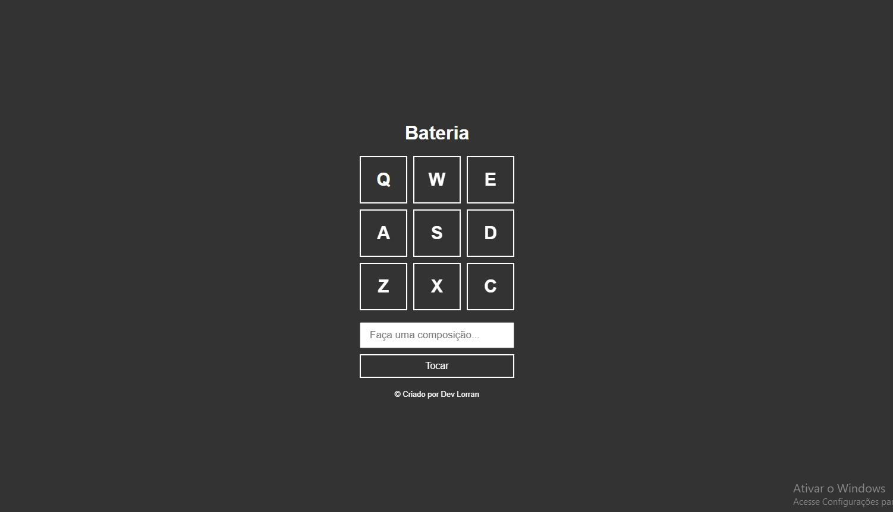

<h1 align="center"> BATERIA </h1>

  <a href="#-tecnologias">Tecnologias</a>&nbsp;&nbsp;&nbsp;|&nbsp;&nbsp;&nbsp;
  <a href="#-projeto">Projeto</a>&nbsp;&nbsp;&nbsp;
  

 

  

## 🚀 Tecnologias

Esse projeto foi desenvolvido com as seguintes tecnologias:

- HTML e CSS
- JavaScript
- Git e Github

## 💻 Projeto

Este é o meu mais novo projeto.

- [Acesse o projeto finalizado, online](https://bateria-lyart.vercel.app/)

## 🚀 Habilidades práticadas
A intenção foi práticar funções, trabalhar com eventos, tanto de teclado, como de click na tela, trabalhando também com o input de receber os comandos a serem tocados, foi feito a utilização de times/tempo e de loops. 